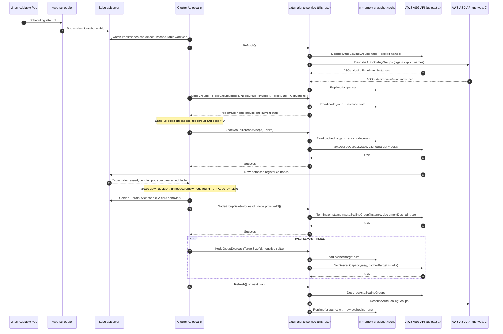

# Cluster Autoscaler External gRPC AWS Flow

This diagram shows how Kubernetes Cluster Autoscaler (CA) interacts with this service and how this service fans out to AWS regional APIs.

## Process Description

1. Trigger and observation:
   - A pod cannot be scheduled, and `kube-scheduler` records this via `kube-apiserver`.
   - Cluster Autoscaler watches API state (pods and nodes) and starts a scale evaluation loop.

2. External provider state sync:
   - CA calls `Refresh()` on this service.
   - This service queries each configured AWS region (`DescribeAutoScalingGroups`) and rebuilds an in-memory snapshot cache keyed by `region/asg-name`.

3. Scale-up path:
   - CA reads nodegroup inventory and state through gRPC calls (`NodeGroups`, `NodeGroupNodes`, `NodeGroupTargetSize`, etc.).
   - CA chooses a nodegroup and sends `NodeGroupIncreaseSize` with positive delta.
   - This service routes by `region/asg-name` and calls regional AWS ASG `SetDesiredCapacity`.
   - AWS launches instances, nodes register to the cluster, and pending pods become schedulable.

4. Scale-down decision and propagation:
   - CA decides scale-down from Kubernetes state (for example, low-utilization or empty nodes after scale-down timers and safety checks).
   - CA typically drains/evicts via Kubernetes APIs, then calls `NodeGroupDeleteNodes`.
   - This service calls AWS `TerminateInstanceInAutoScalingGroup` with `ShouldDecrementDesiredCapacity=true`, so instance count and desired capacity both drop.
   - CA may also call `NodeGroupDecreaseTargetSize` (negative delta), which this service maps to AWS `SetDesiredCapacity`.

5. Eventual consistency:
   - This service is cache-backed for reads and size math.
   - Updated desired/current values are reflected after the next `Refresh()` rebuild.
